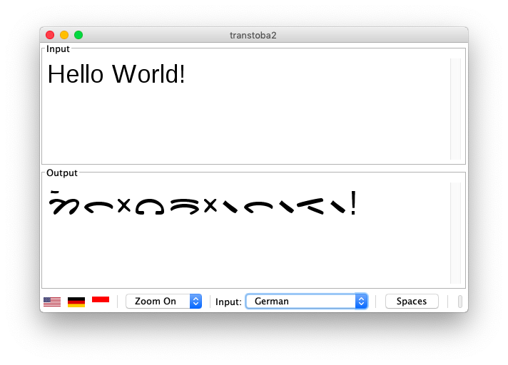

# transtoba2

This application is intended to facilitate the transliteration – or transcription – of a word or a text from the Roman script into the Toba Batak script. Transliterating from the Roman into the Batak script is not an easy undertaking as the Batak script has a number of peculiarities that complicates the process of transliteration. This program uses a set of algorithms which enables the user to effortless transliterate from the Roman to the Toba Batak script.



You may compile this application using javac (see build.sh) – then you can embed it in web pages to run as an applet or launch it as a standalone application by running ```java -jar transtoba2*jar```. The application builds with java 1.5 to 1.8 with warnings. It should be fixed in the future or even reimplemented using javascript. The language flag icons come from Wikimedia Commons.

The font is (c) by Uli Kozok: https://ulikozok.com/aksara-batak/batak-font/

The application works close to perfect in transliterating Toba Batak words into the Toba Batak script. The input language can also be set to Indonesian and to German. The algorithms have been set in such a way that it is possible to transliterate Indonesian words without any difficulty. The same cannot be said for German as there are too many sounds in the German language, such as sch and h, for instance, that are unknown in Batak. The main reason why German language algorithms were included lies in the history of transtoba, which was initially created to facilitate the transliteration of German proper names.

The transliteration of Indonesian words works quite well, but a few compromises were necessary. Unlike Karo and Pakpak Batak, Toba Batak does not have a letter for the schwa (the weak e-sound) as this sound is unknown in Toba. To transliterate Indonesian language words we decided to use the letter é for both é and the schwa.

The Batak script does not have letters for c, f, q, v, x, and z. In he case of q and x this does not pose any problems as these are redundant letters anyway and do not occur in the Indonesian language. Even in loanwords that have the letter x such as taxi (borrowed from Dutch) the x is rendered ks in Indonesian (taksi). In transtoba2 all x and q are rendered ks and k.

The letter f occurs in the Indonesian language only in loanwords from foreign languages such as Arabic. Even in Indonesian it is in many cases substituted by the letter p, and consequently we use p as a substitute for the letter f. As the letter v is pronounced f in Indonesian, it is treated the same way f is treated, namely by substituting it with p.

As the letter z is usually pronounced and also often written as j in the Indonesian language, it will be substituted by j.

The Toba Batak script also does not have a letter for c, which is a frequently used consonant in the Indonesian language. In Mandailing Batak, which has this consonant, it is formed by placing two horizontal strokes known as tompi above the letter s. We decided to use this Mandailing letter to render c. A word of caution needs to be added here: some Toba Batak words do have sounds that somehow resemble the Indonesian c sound. An example is ucok. which, however, is correctly spelled unsok (pronounced utsok), and not ucok!

Toba Batak also does not know the phoneme ny which commonly occurs in Indonesian and also in Mandailing Batak so that we decided to use the Mandailing NYA.

The Toba Batak language does not have the velar fricative h which is so common in Indonesian. As Karo and Pakpak Batak do have a letter for the velar fricative we decided to use this to render this sound in Indonesian words such as rumah. We could also have used the letter h, which, however, is always pronounced k in final position and never h and hence not suitable to render the Indonesian velar fricative h.

Please report bugs and suggestions for improvements to

uli@bahasa.net and leander@seige.name

Remove brackets and spaces from the mailaddresses to make them functional.

Uli Kozok & Leander Seige

Norden & Leipzig 29/6/2008
